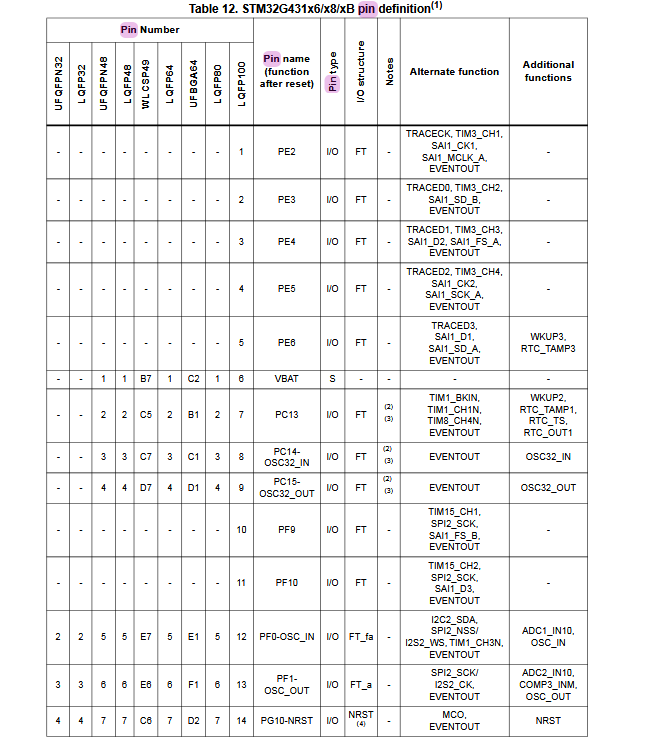

# 2526\_Projet1A\_veste\_lumineuse

Veste lumineuse


## Memo GitHub

```bash
git clone <url ssh du code> # pour créer le sous-dossier sur le PC 

cd 2526_Projet1A_veste_lumineuse  # pour entrer dans le dossier et pouvoir faire des git pull et git status

ls # pour dire dans quel dossier on se trouve

cat README.md # pour voir ce que Git lit actuellement

explorer .  # savoir quelle README.md le git lit si on crée 2 readme.md (probablement causé par un git clone)


git pull # récupérer les dernières modifications

# On travaille

git status # vérifier les modifications

git add . # ajouter les fichiers au prochain commit

git commit -m "Message"

git push


```
utiliser Visual studio Code pour la partie software sur readme

Cahier des charges : carte PCB 40mm-40mm


Guide des Composants : interrupteur, kappa de découplage, résistance, diode chenillard, connecteur INPUT/OUTPUT (alim), connecteur SWD


## Fonctionnement du connecteur SWD

Le connecteur SWD permet d'injecter le code compilé (le binaire) dans la mémoire flash de la puce. Et il permet le Débogage en temps réel, càd "mettre en pause (breakpoints)" , "lire et modifier" la valeur des variables ou des registres internes pendant que le code tourne et "avancer pas à pas" dans les lignes de code pour comprendre pourquoi un bug survient.
structure :

VCC (VTarget) : Pour que la sonde de débogage connaisse la tension logique de la carte (souvent 3.3V).

SWDIO : Le flux de données.

SWCLK : Le signal d'horloge pour synchroniser les données.

GND : La masse commune.

RESET (Optionnel) : Pour forcer le redémarrage de la puce.

## datasheet de la STM32 sur les PIN définitions

