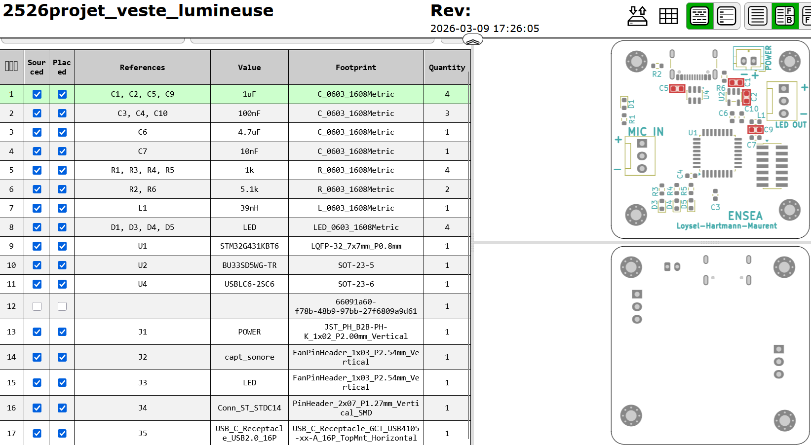
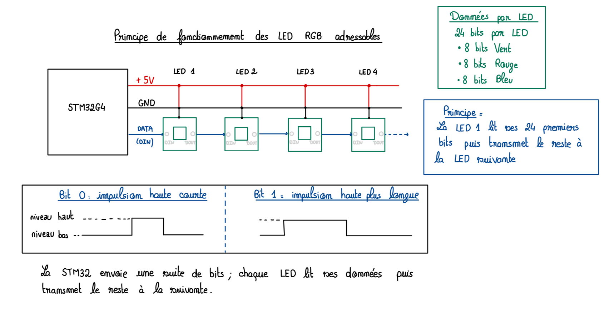
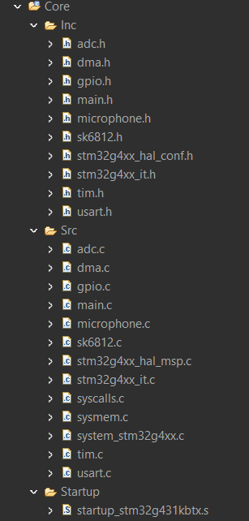
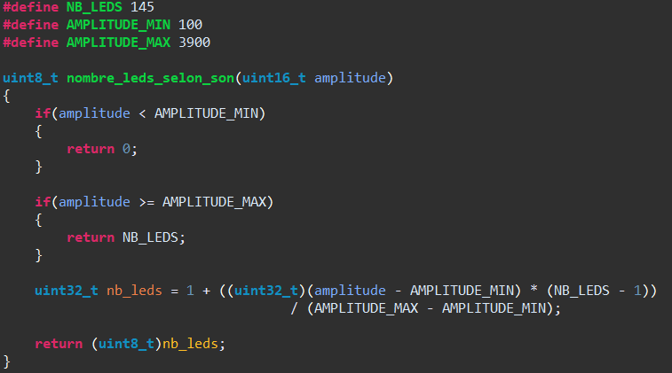
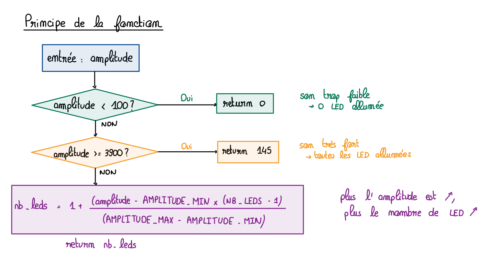
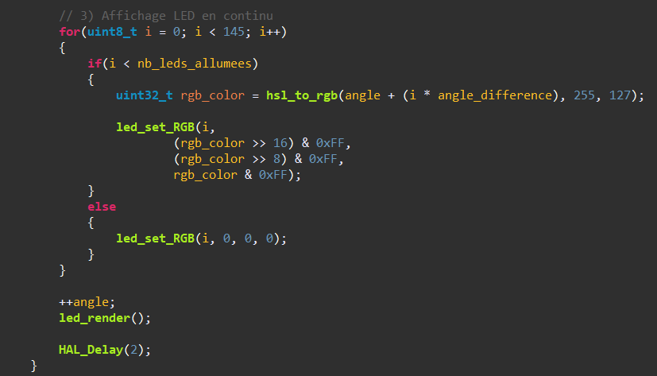

# 2526\_Projet1A\_veste\_lumineuse


## Memo GitHub

```bash
git clone <url ssh du code> # pour créer le sous-dossier sur le PC 

cd 2526_Projet1A_veste_lumineuse  # pour entrer dans le dossier et pouvoir faire des git pull et git status

ls # pour dire dans quel dossier on se trouve

cat README.md # pour voir ce que Git lit actuellement

explorer .  # savoir quelle README.md le git lit si on crée 2 readme.md (probablement causé par un git clone)


git pull # récupérer les dernières modifications

# On travaille

git status # vérifier les modifications

git add . # ajouter les fichiers au prochain commit

git commit -m "Message"

git push


```
Conseil : utiliser Visual studio Code pour la partie software sur readme

## Sommaire
I  ) Introduction

II ) Hardware

     a) Sélection des composants

     b) Logiciel KiCad
 
    c) Soudure du PCB

III) Software

     a) Récupération de valeurs par le microphone

     b) Allumage des LED NeoPixel

     c) Dégradé de couleurs (optionnel)

IV ) Démonstration du produit final (lien vidéo)

V  ) Difficultés rencontrés dans le projet

## Introduction 

Dans le cadre d'un projet d'électronique de 1ère année, il nous est demandé de concevoir une veste lumineuse dont les lumières réagissent aux bruits environnants. Par manque de temps, nous avons interprété et restreint la consigne par : créer une bande de LED qui allume de plus en plus de LED simultanément à mesure que le bruit ambiant s'intensifie.
Le principe de fonctionnement repose sur la détection de l’amplitude sonore avec l’acquisition du signal au microphone. Le signal récupéré est ensuite analysé par le microcontrôleur qui renvoie des valeurs d’amplitude. En fonction de cette amplitude, si une certaine valeur est dépassée, différentes LEDs s’allument progressivement, créant ainsi un effet visuel synchronisé avec la musique ou les sons environnants.


## Hardware : a) Sélection des Composants

On travaille sur une carte PCB 40mm-40mm (taille suffisante pour placer tous nos composants) avec 4 couches : 5V,3.3V,3.3VA,GND .

Guide des Composants : régulateur de tension(BU33SD5WG-TR), connnecteur USB-C, condensateur de découplage, résistance, diode chenillard, connecteur INPUT/OUTPUT (alim) , connecteur SWD, microcontrôleur STM32G431KBT6.

On place des diodes chenillard implémenté sur le PCB afin de vérifier le bon fonctionnement sur la partie firmware 
càd on isole le problème : si les LED finaux ne fonctionnent pas, est-ce parce qu'ils sont mal soudés ou alors est-ce à cause du code; les chenillard ici nous donne la solution.

------ Fonctionnement du connecteur SWD ------

Le connecteur SWD permet d'injecter le code compilé (le binaire) dans la mémoire flash de la puce. Et il permet le Débogage en temps réel, càd "mettre en pause (breakpoints)" , "lire et modifier" la valeur des variables ou des registres internes pendant que le code tourne et "avancer pas à pas" dans les lignes de code pour comprendre pourquoi un bug survient.
structure :

VCC (VTarget) : Pour que la sonde de débogage connaisse la tension logique de la carte (ici 3.3V).

SWDIO : Le flux de données.

SWCLK : Le signal d'horloge pour synchroniser les données.

GND : La masse commune.

RESET (Optionnel) : Pour forcer le redémarrage de la puce.

----------------------------------------------

Voici un aperçu du PCB et de la BOM pour résumer la liste de nos composants.




## Hardware : b) Logiciel KiCad

schéma Kicad et PIN def de la STM32


On trouve, sur la documentation de notre microcontrôleur (le STM32G431KBT6), les condensateurs de découplage à placer.


Visuel du schéma complet du PCB.


## Hardware : c) Soudure du PCB

Lors de l'assemblage de notre circuit chenillard, une attention particulière doit être portée au sens des LED. Étant des diodes, elles possèdent une polarité stricte et ne laissent passer le courant que dans un seul sens. Pour garantir un montage sans erreur, un repère en forme de « T » est présent au dos de chaque composant pour indiquer clairement l'orientation à respecter sur le PCB.

Concernant la fabrication, la réception de nos PCB à vide accompagnés de leur pochoir (stencil) nous a permis d'optimiser considérablement le processus. L'application de pâte à braser via cette méthode s'avère en effet beaucoup plus rapide et offre une précision de soudure nettement supérieure à un assemblage réalisé entièrement à la main.

Au Fab Lab nous avons réalisé la soudure du microphone avec un connecteur tripolaire pour pouvoir le relier au connecteur de notre PCB.
Mise en garde : Bien mettre la gaine (ici en jaune) pour éviter tout court-circuit et conserver une bonne robustesse de l'ensemble déjà soudé.


## Software : a) Récupération de valeurs par le microphone

Côté logiciel, la gestion de l'échantillonnage s'appuie sur le TIMER6 plutôt que sur les fonctions d'attente classiques de la bibliothèque HAL, ce qui garantit un chronométrage matériel ultra-précis et surtout non bloquant pour le reste du programme. Ainsi, à chaque interruption définie par la période TimeCallElapse, le microcontrôleur relève instantanément la valeur du microphone pour alimenter notre tableau d'écoute de manière parfaitement cadencée.

Une fois ces données acquises, un traitement est nécessaire car le signal brut oscille entre 0 et 4096, avec un bruit ambiant (environ 40 dB) centré sur la valeur 2000. Pour simplifier l'analyse, il est beaucoup plus naturel de fixer ce silence relatif à 0 ; notre fonction vient donc translater le signal en calculant l'amplitude temporelle via une simple soustraction max - min, nous offrant ainsi des données exploitables comprises entre 0 et 2000.

## Software : b) Allumage des LED NeoPixel

Durant les premières séances, nous avons utilisé notre carte STM32 pour réaliser les premiers essais, car le PCB était encore en cours de fabrication. Nous avons d’abord tenté de souder les LED une par une, mais le montage ne fonctionnait pas correctement. Ce dysfonctionnement pouvait venir d’une détérioration des LED pendant la soudure, à cause d’un échauffement trop important, ou bien d’un défaut des LED ou des connexions. Nous avons donc décidé d’utiliser un ruban de LED RGB adressables, plus fiable et plus simple à mettre en œuvre.


 
Cependant, les LED adressables ne se commandent pas comme des LED classiques. Elles suivent un principe particulier :



### Rôle du timer et du signal PWM
Pour commander les LED RGB adressables, la STM32 envoie une suite de bits sur le fil DATA. Les LED différencient un bit 0 d’un bit 1 grâce à la durée de l’impulsion à l’état haut.

Un signal PWM alterne entre un état bas et un état haut. En modifiant le temps passé à l’état haut, on peut créer deux types d’impulsions :
- une impulsion courte pour envoyer un bit 0 ;
- une impulsion plus longue pour envoyer un bit 1.

Le timer permet donc d'envoyer un signal PWM stable pour que les LED comprennent correctement les données.

### STM32G4

Une fois le PCB prêt, nous avons dû adapter notre programme à une autre carte : la STM32G4. Le code précédent n’était pas directement compatible, car les fichiers de configuration, les bibliothèques HAL et certains périphériques internes peuvent changer d’une famille de STM32 à une autre.

Nous avons donc importé les dossiers et fichiers nécessaires correspondant à cette nouvelle STM32G4. Cela comprenait notamment les fichiers liés au microcontrôleur, à la configuration des périphériques, aux timers, aux GPIO et aux bibliothèques HAL.



Une fois que la bande de LED adressables s'allument sur notre nouvelle carte STM32G4, nous avons pu passer à l’assemblage des deux parties principales du programme :

le code de commande des LED ;
le code d’acquisition du microphone.

L’objectif était de faire fonctionner les deux programmes ensemble. Le microphone permet de mesurer l’intensité sonore ambiante, puis cette valeur est utilisée pour modifier l’affichage des LED. Par exemple, lorsque le son détecté est faible, peu de LED s’allument. Lorsque le son devient plus fort, un plus grand nombre de LED peut s’allumer ou la couleur peut changer.




## Software : c) Dégradé de couleurs (optionnel)


Nous cherchons à créer un pattern avec le chenillard pour l'esthétisme des LED : avec pour objectif des LED qui changent de couleurs avec ces dernières qui déplacent les couleurs le long de la chaîne, voici le code utilisé pour réaliser cela :



Cette partie du code sert à afficher un dégradé de couleurs sur le ruban de LED. Le programme parcourt toutes les LED une par une. Si la LED fait partie du nombre de LED à allumer, une couleur est calculée avec la fonction `hsl_to_rgb()`. La couleur dépend de la position de la LED dans le ruban, ce qui permet d’obtenir un dégradé.

Si la LED ne doit pas être allumée, elle est mise en noir avec `led_set_RGB(i, 0, 0, 0)`, ce qui revient à l’éteindre.

Une fois que toutes les couleurs sont définies, la fonction `led_render()` envoie les données au ruban. La variable `angle` est ensuite augmentée pour faire évoluer les couleurs au cours du temps, ce qui crée un effet animé. 


## Démonstration du produit final (lien vidéo)

Cliquer sur l'un des hyperliens obtenir un aperçu du projet final.

https://www.youtube.com/watch?v=zNhibc-cM8I

## Difficultés rencontrées au cours du projet 

Au cours du projet, plusieurs difficultés techniques ont été rencontrées.

1. Récupération du signal sonore : Le code renvoyait au début des valeurs incohérentes 
(screen). Nous avons résolu ce problème en intégrant les timers au code.

2. PCB : Nous n’avions soudé qu’un seul PCB, ce qui rendait la répartition des tâches 
compliquée car une seule personne pouvait faire des tests à chaque fois. Nous 
aurions dû souder au moins 3 PCB pour que chacun puisse travailler sa partie en 
même temps.

3. Soudure des leds : Nous utilisions au début des leds neopixels RGB que nous 
soudions une à une. Mais la chaleur lors de la soudure cramait les leds, et pendant 
longtemps nous sommes restés bloqués sur le code car il ne fonctionnait pas sans 
savoir que c’était les leds qui ne fonctionnaient plus.


## Conclusion

Ce projet de veste lumineuse réactive au son nous a permis de découvrir concrètement le fonctionnement d’un système électronique interactif. Grâce à l’utilisation d’un microphone, d’un microcontrôleur et de LEDs, nous avons réussi à concevoir un prototype capable de traduire l’intensité sonore en effets lumineux. Malgré les difficultés rencontrées, les différentes phases de tests et d’amélioration nous ont permis d’obtenir un système fonctionnel. Enfin, cette expérience ouvre la voie à de nombreuses améliorations possibles, comme l’ajout de nouveaux effets lumineux, l’utilisation de LEDs RGB, une meilleure analyse du signal audio ou encore l’intégration d’une batterie afin de rendre la veste totalement autonome et plus adaptée à une utilisation réelle.
