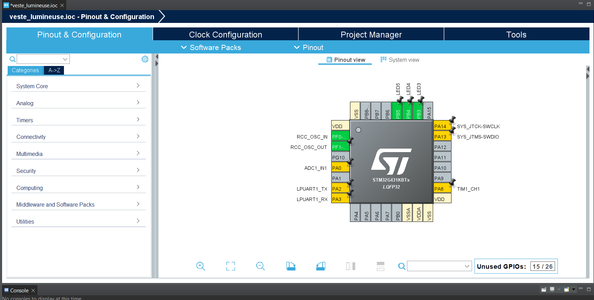
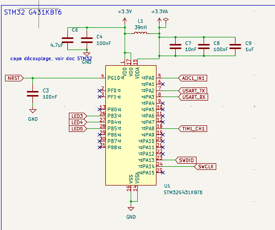
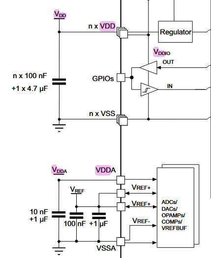
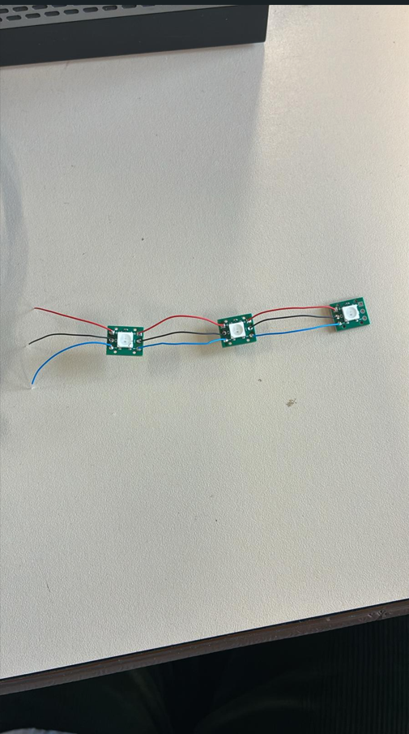
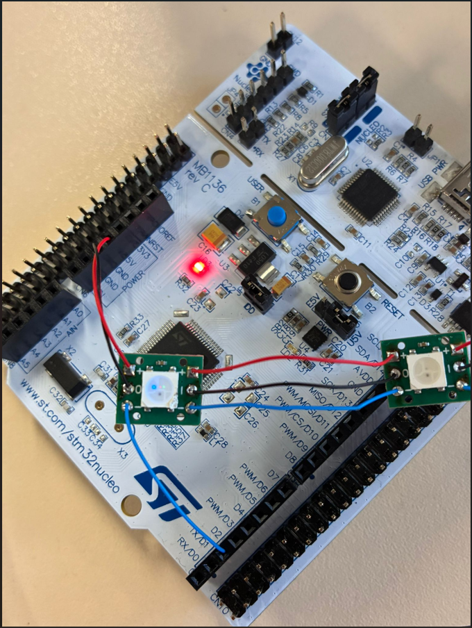
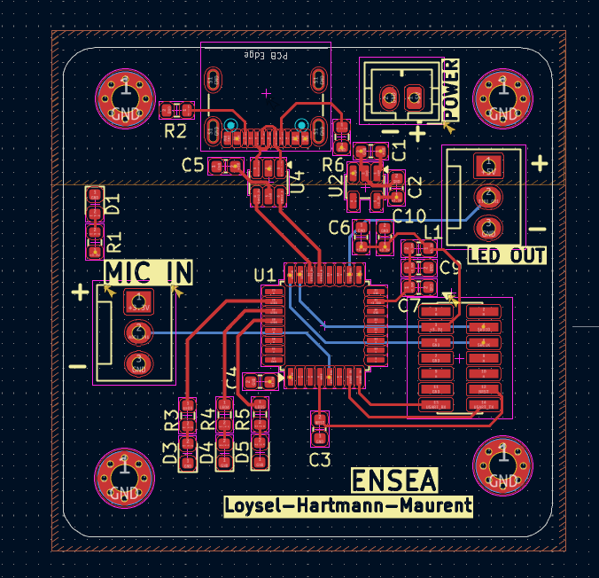
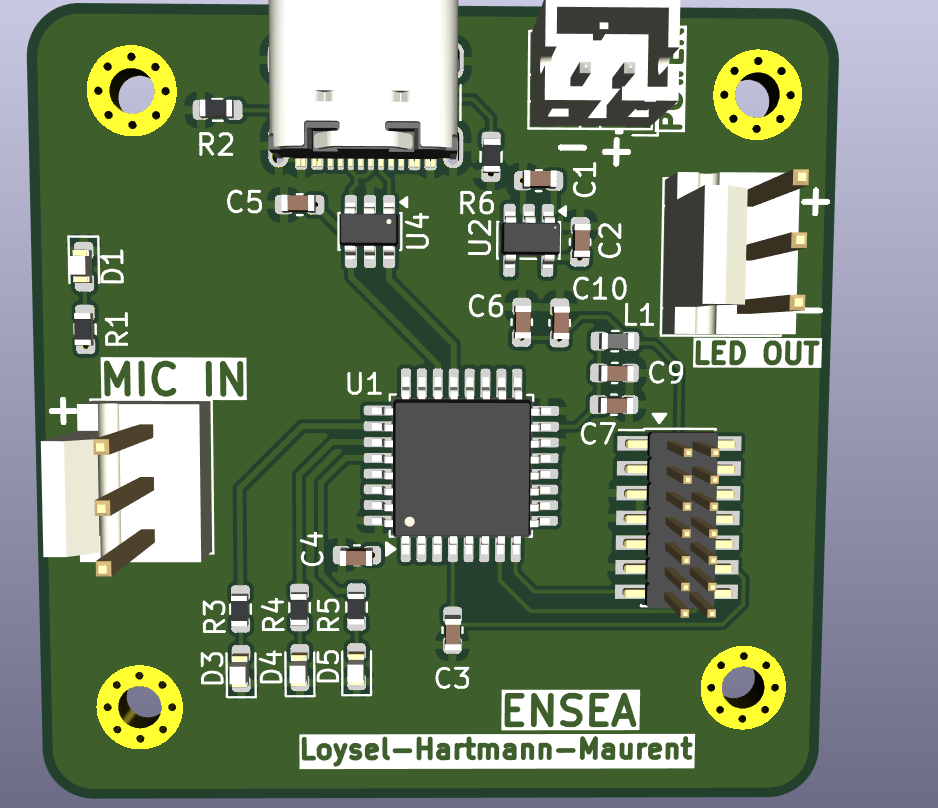
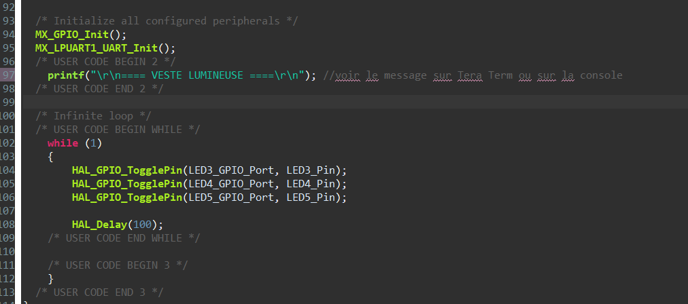
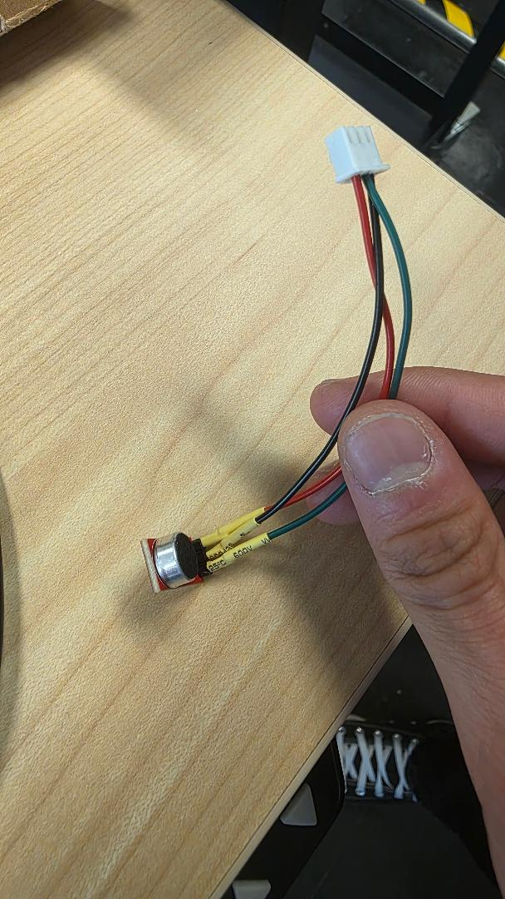

# 2526\_Projet1A\_veste\_lumineuse


## Memo GitHub

```bash
git clone <url ssh du code> # pour créer le sous-dossier sur le PC 

cd 2526_Projet1A_veste_lumineuse  # pour entrer dans le dossier et pouvoir faire des git pull et git status

ls # pour dire dans quel dossier on se trouve

cat README.md # pour voir ce que Git lit actuellement

explorer .  # savoir quelle README.md le git lit si on crée 2 readme.md (probablement causé par un git clone)


git pull # récupérer les dernières modifications

# On travaille

git status # vérifier les modifications

git add . # ajouter les fichiers au prochain commit

git commit -m "Message"

git push


```
Conseil : utiliser Visual studio Code pour la partie software sur readme

## Sommaire
I  ) Introduction

II ) Hardware

     a) Sélection des composants

     b) Logiciel KiCad
 
    c) Soudure du PCB

III) Software

     a) Récupération de valeurs par le microphone

     b) Allumage des LED NeoPixel

     c) Dégradé de couleurs (optionnel)

IV ) Démonstration du produit final (lien vidéo)

V  ) Difficultés rencontrés dans le projet

## Introduction 

Dans le cadre d'un projet d'électronique de 1ère année, il nous est demandé de concevoir une veste lumineuse dont les lumières réagissent aux bruits environnants. Par manque de temps, nous avons interprété et restreint la consigne par : créer une bande de LED qui allume de plus en plus de LED simultanément à mesure que le bruit ambiant s'intensifie.


## Hardware : a) Sélection des Composants

liste des composants principaux qui composent le PCB (en excluant résistances et condensateurs)

On travaille sur une carte PCB 40mm-40mm (taille suffisante pour placer tous nos composants) avec 4 couches : 5V,3.3V,3.3VA,GND .


Guide des Composants : interrupteur, kappa de découplage, résistance, diode chenillard, connecteur INPUT/OUTPUT (alim), connecteur SWD

On place des diodes chenillard implémenté sur le PCB afin de vérifier le bon fonctionnement sur la partie firmware 
càd on isole le problème : si les LED finaux ne fonctionnent pas, est-ce parce qu'ils sont mal soudés ou alors est-ce à cause du code; les chenillard ici nous donne la solution.

------ Fonctionnement du connecteur SWD ------

Le connecteur SWD permet d'injecter le code compilé (le binaire) dans la mémoire flash de la puce. Et il permet le Débogage en temps réel, càd "mettre en pause (breakpoints)" , "lire et modifier" la valeur des variables ou des registres internes pendant que le code tourne et "avancer pas à pas" dans les lignes de code pour comprendre pourquoi un bug survient.
structure :

VCC (VTarget) : Pour que la sonde de débogage connaisse la tension logique de la carte (ici 3.3V).

SWDIO : Le flux de données.

SWCLK : Le signal d'horloge pour synchroniser les données.

GND : La masse commune.

RESET (Optionnel) : Pour forcer le redémarrage de la puce.

----------------------------------------------

## Hardware : b) Logiciel KiCad

schéma Kicad et PIN def de la STM32







## Mise en oeuvre des LED (mise en série + code fonctionnel)





## KiCad version final 




## Vérification du bon fonctionnement du PCB
On réussit à faire clignoter les LED avec le code suivant : 


## Hardware : c) Soudure du PCB

/// mettre photo zoomé sur les LED chenillard du PCB pour informer qu'il y a un sens (oui car toutes LED sont des diodes) donné au dos avec un T qui l'indique. ///

/// photo des PCB à vide + du Stencil : et dire que la méthode avec la pâte à braser est bcp plus rapide et plus précise qu'à la main ///

Au Fab Lab nous avons réalisé la soudure du microphone avec un connecteur tripolaire pour pouvoir le relier au connecteur de notre PCB.
Mise en garde : Bien mettre la gaine (ici en jaune) pour éviter tout court-circuit et conserver une bonne robustesse de l'ensemble déjà soudé.



à ENLEVER $$$
Au cours des séances dernières, le PCB étant inutilisable car il nous fallait finir de souder les connecteurs "MIC IN" et "LED OUT" nous avons réparti entre nous les tâches suivantes : 
Antoine -> au Fab lab pour souder les connecteurs au PCB

Margaux -> écriture du code des LED chenillardes avec la nucléo donnée par l'établissement car le PCB étant en finition (cependant, cette stm32 diffère avec celui qu'on utilise dans notre PCB, ce qui exige de changer quelques lignes de code) 

Lou-Jane -> écriture du code des LED chenillardes et utilisation de l'oscilloscope pour vérifier le bon fonctionnement de celles-ci.
$$$

## Software : a) Récupération de valeurs par le microphone

/// Photo TIMER6 et parler de l'avantage d'utiliser ça et non les fonctions HAL que propose C ///
// Bash : Code de la fonction qui donne la valeur max : dire que les valeurs vont de 0 à 4096 avec pour valeur 2000 avec le bruit ambiant, comme il est plus naturel de calculer en prenant comme repère 0 traduisant le silence -> 40 dB bruit ambiant , nous avons alors translater les valeurs pour avoir entre 0 et 2000 au lieu de 2000 et 4096. Ceci ce traduit par un return de la fonction par max - min (c'est-à-dire la fonction relève l'amplitude). //
// Code d'une liste qu'on prend où on écoute : et avec TimeCallElapse qui est la période des interruptions et qui restitue une valeur prise par le microphone //

## Software : b) Allumage des LED NeoPixel

à vous : Margaux et Lou-Jane 

à ENLEVER $$$
Dans un premier temps, nous cherchons à faire clignoter la chaîne de LED pour vérifier le bon fonctionnement de nos composants, voici le code utilisé : 
```bash
------à remplir------
```

Dans un troisième temps, nous récupérerons les valeurs obtenues par le microphone, d'une part en observant à l'oscilloscope puis en regardant directement sur l'ordinateur :
```bash
------à remplir------
```
Dans un dernier temps, nous allons relier le fonctionnement du microphone avec celui de la chaîne de LED afin de donner de la cohérence entre l'allumage des LED avec les Pics d'intensité sonore captés par le microphone :
```bash
------à remplir------
```

$$$

## Software : c) Dégradé de couleurs (optionnel)


Nous cherchons à créer un pattern avec le chenillard pour l'esthétisme des LED : avec pour objectif des LED qui changent de couleurs avec ces dernières qui déplacent les couleurs le long de la chaîne, voici le code utilisé pour réaliser cela :
```bash
------à remplir------
```

## Démonstration du produit final (lien vidéo)

Cliquer sur l'un des hyperliens obtenir un aperçu du projet final.
www.linkedin.com/in/antoine-loysel
www.youtube_vidéo_veste_lumineuse
www.linkedin_margaux_maurent
www.linkedin_LouJane_Hartmann


## Difficultés rencontrées au cours du projet 

// parler des LED à souder une par une : elle chauffe trop, c'est pas normal -> demander à margaux pk //
// Screen des valeurs du microphone avec les fonctions HAL qui était autour de 700 : ce qui est absurde. Mais désormais avec l'usage de Timer tout est bon //
// N'avoir qu'un seul PCB rend difficile la répartition des tâches car on doit attendre que l'un ait fini avec le PCB avant de faire ses mesures ce qui retarde la chaîne de travail : une des solutions aurait été de faire plusieurs PCB (solution réalisable car le PCB et les composants était rapide à souder). // 


